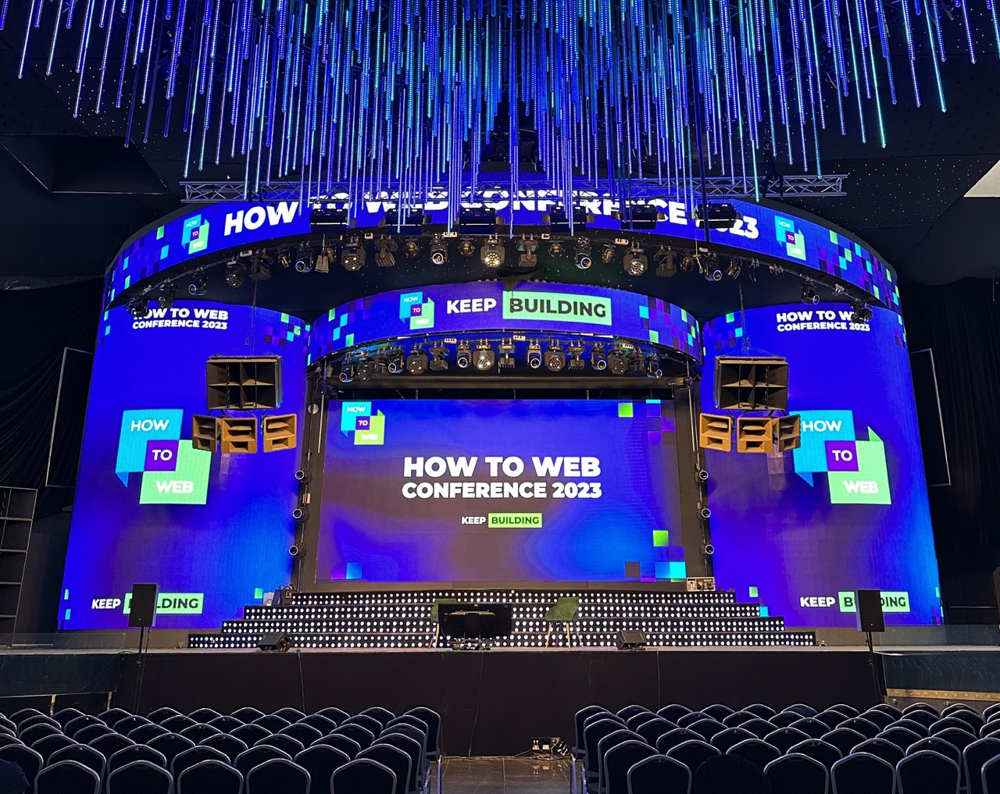
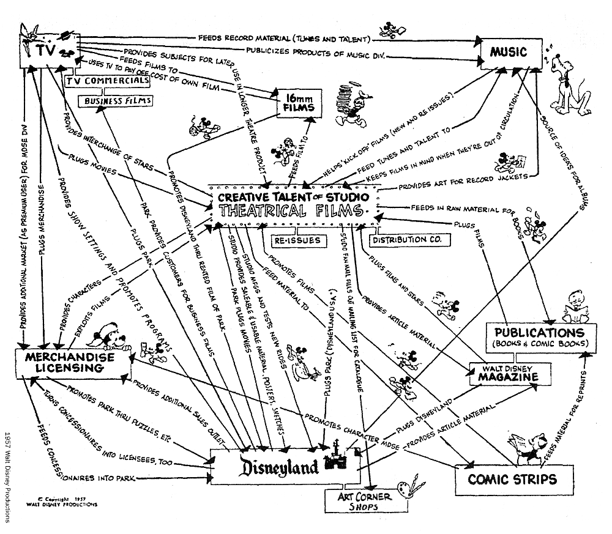

 

# How to Web

[How to Web](https://www.howtoweb.co) is **East Europe's largest startup, product, and business conference**. It was held in Bucharest, Romania's capital, on October 4 and 5.

What I liked about this year's conference (and past editions) was the combination of **talks** from well-known people in the startup and product industry, as well as the **opportunity to meet new and familiar faces**. They provide [Brella](https://www.brella.io/), an application that allows attendees to view the agenda as well as other participants who may be of interest to them. In addition, **side events** are planned, the best of which is an after-party on the final conference day organised in partnership with a local startup and technology community.

**AI** was an important topic throughout the conference. Almost every session mentioned **LLMs** and their incorporation into products to provide customers or users with novel features. The same was true for startups with a presentation booth or competing in **Spotlight**, a contest with a total prize fund of 880,000 EUR (VC-backed and equity-based): the majority of them integrate a form of AI for providing "copilots" or full automation of operations that were previously performed manually by people.

# Top 3 events

[Because the morning was occupied by OWASP Global AppSec](/owasp-global-appsec-23), I was only able to attend the afternoon events. Here are my personal favourites.

## Five rules for growth: developing products 10 million users love

The rules were put together by the current VP of product at [DeepL](https://www.deepl.com/translator), a neural network-powered translation service. He previously worked for fast-growing organisations that doubled in size every year. He proposed the following **rules for product development**:

1. Identifying and focusing on a growth engine (similar to the one invented by Walt Disney).
2. Set as few priorities as possible and base your decisions on data.
3. Experiment. Some ideas will fail, but the organisation is going to grow.
4. Evaluate and regularly adjust your risk profile.
5. Give people responsibilities that are out of their league. This requires taking risks; they may fail, but the people will grow.

 

## Building deep-tech products and startups from Eastern Europe

The panel included the CEO of a Bulgarian online magazine focused on the CEE startup environment, two venture capitalists, and a board member of the European Innovation Council. They talked about the typical hero journey of **deep-tech founders**: after years in university, they try to bring the difficult topic that they've researched outside of academia. The shift is frequently difficult because the newly founded seed startup will still have a strong technical mindset and a feature-focused vision. It takes time for them to progress from technical roles to becoming leaders.

## Using AI to build a new generation of products

[Zachary Gleicher](https://www.howtoweb.co/speaker/zachary-gleicher/) is a [Google DeepMind](https://www.deepmind.com/) Applied Product Management. DeepMind was a business that specialised in researching artificial intelligence topics and was subsequently acquired by Google in 2014.

Zachary gave a brief overview of artificial intelligence and mentioned WaveNet as a success story because of its inclusion in many Google products. Furthermore, he quickly described the **three-staged approach** that he employs:

- Pairing strictly technical research with customer-facing products;
- Incubating the integration; and
- Launching the integration to the public.
