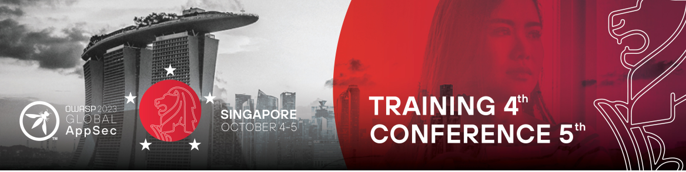

# OWASP Global AppSec Singapore

The Open Web Application Security Project, the organisation behind the well-known [OWASP Top 10](https://owasp.org/www-project-top-ten/), organised the OWASP Global AppSec Singapore **application security conference**. I attended two days, October 4 and 5, one for a workshop and the other for talks.

Despite its name and the normal style for Global AppSec conferences, the conference was online-only and adhered to the Singapore timezone. This meant an early start time for me (4 AM, for the Romanian timezone), but [it was good to be able to attend How to Web in the afternoons](/htw-23).

# Top 3 events

Here are my personal favourites:

## Threat Modelling: From None to Done

John DiLeo, a Solution Architecture Lead at [IriusRisk](https://www.iriusrisk.com/) and the OWASP leader in New Zealand, led the 7-hour workshop. The presented workflow had a **shift-left approach**, prioritising security investments as near to the design phase as possible. This contrasts with the prior shift-right model, in which security personnel were focused on incident response on an inadequate infrastructure.

**Threat modelling** is a type of risk analysis in which the most valuable assets (i.e., anything that should be safeguarded from some attackers) and their threats (i.e., anything that could allow someone or anything to obtain, damage, or destroy an asset) are identified.

 

The following characteristics of a threat model were taken into account:

- Location: in a persistent, sharable and redundant (with multiple backups) directory
- Involved persons: model creators (the people knowing the system really well), model owners (for accountability), model maintainer, and other stakeholders (for example, cyber insurance providers and customers)
- Lifetime: creation at the beginning of the existence of the system/application (or ASAP, if not available for an existent system/application), and an update per cycle
- Content
    - Protected assets or "What are we building?", by  using techniques such as data-flow diagrams and asset management
    - Threats or "What can go wrong?" by using techniques such as attack trees, STRIDE, and threat libraries
    - Possible mitigations or "What we will use?" (coupled with the concept of orders of magnitude, which is presented below)
    - Risk acceptance or "Have all residual risks been accepted?" by doing a cost-benefits analysis over the candidate mitigations (as they will not remove the residual risk, but only decrease it)
    - Mitigation verification or "How we will know it works?" by doing penetration tests.

An additional concept that I thought was important is the **order of magnitude for mitigations**, which can be combined with defence-in-depth: "*If a mitigation with an order of magnitude N (i.e., at the layer N in a layered security architecture) can fail, then another mitigation with the order N + 1 should be put in-place*".

The workshop also included a hands-on component. Given a customer-facing, serverless web project, we choose one of its user stories: account details updating. We developed the threat model based on this.

## A Retrospective on Application Security Failures

The presentation focused on **application security posture management**, incorporating subjects such as software composition analysis, SAST, DAST, developer learning platform, infrastructure as code scanning, and secret scanning.

One key lesson offered by the presenter based on his experience was the goal of establishing security design patterns that are included by default in the products to avoid bug classes rather than filing Jira tickets for found concerns. Secret scanning, default encryption, application event logging, and input validation routines are examples of patterns.

## Large-Scale Application Attack Surface Management

The significance of **asset management** was the beginning point for this discussion. Each organisation should have an up-to-date list of assets (software, servers, documents, services, and so on) in order to know what to fight against and where attackers might try to exploit.

With this as a basis, the speaker went on to illustrate how organisations might identify their attack surface, or the set of places in their informational architectures where an attacker could try to access the organisation (e.g., APIs, DNS records, applications). OSINT, code review, code annotation, traffic collection and analysis, runtime instrumentation, and analysis of relevant files (such as API contracts and Android manifests) were all given as approaches.
