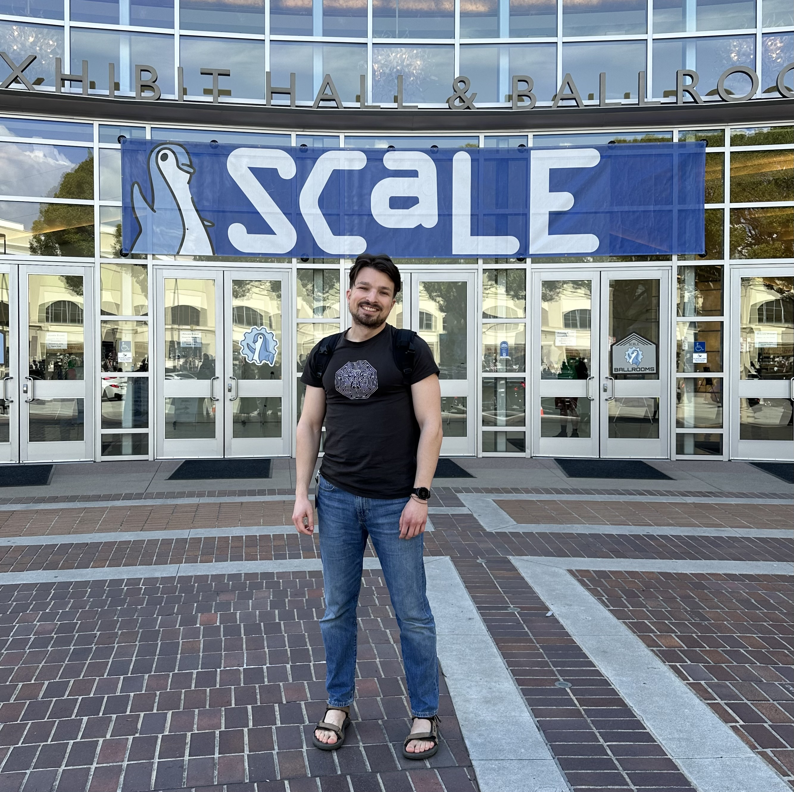

## MutableSecurity

After finishing [Innovation Labs](https://www.innovationlabs.ro/) in July 2022, [Ziarul Financiar](https://www.zf.ro) was kind enough to invite me to pitch and discuss ([recording](https://www.youtube.com/watch?v=uJvVJhoT6QM)) about [MutableSecurity](https://mutablesecurity.io/) in its [ZF IT Generation](https://www.zf.ro/zf-it-generation/), a program dedicated to startups.

In November of the same year, the talk "_MutableSecurity: Life’s too short. Automate everything!_" ([listing page](https://def.camp/speaker/george-andrei-iosif), [slides](https://mutablesecurity.io/blog/defcamp-2022#presentation), and [recording](https://www.youtube.com/watch?v=JzyHVNpSHP0)) was accepted in [DefCamp](https://def.camp) 2022, the largest cybersecurity conference in CEE. It was a 30-minute technical presentation of [the open source components](https://github.com/MutableSecurity) that MutableSecurity published.

## The Open Source Fortress: Finding Vulnerabilities in Your Codebase Using Open Source Tools

The autumn of 2023 found me creating [The Open Source Fortress](https://ossfortress.io/), a workshop about finding software vulnerabilities with open source tools. I initially presented the workshop ([listing page](https://events.canonical.com/event/31/contributions/219/) and [slides](https://raw.githubusercontent.com/iosifache/oss_fortress/main/presentations/ubuntu-summit-23/export.pdf)) for an hour and a half at the [Ubuntu Summit](https://events.canonical.com/event/31), a community conference around Ubuntu, Linux, and open source.

Immediately after the Ubuntu Summit, I got 5 minutes to pitch ([slides](https://raw.githubusercontent.com/iosifache/oss_fortress/main/presentations/lightning-talk-23/export.pdf)) the workshop during the lightning talks organised in Canonical, with all colleagues from [Ubuntu Security Team](https://wiki.ubuntu.com/SecurityTeam) and all other engineering teams.

The last speaking opportunity from 2023 was in [DefCamp](https://def.camp): a 30-minute talk called "*The Open Source Fortress: Finding Vulnerabilities in Your Codebase Using Open Source Tools*" ([listing page](https://def.camp/speaker/george-andrei-iosif-2/) and [slides](https://ossfortress.io/defcamp)). It presented the main vulnerability detection techniques and tools covered in [The Open Source Fortress](https://ossfortress.io/).

March 2024 found me presenting in [SCaLE 21x](https://www.socallinuxexpo.org/scale/21x), the largest community-organised open-source conference in North America. The content of the presentation ([listing page](https://www.socallinuxexpo.org/scale/21x/presentations/open-source-fortress), [recording](https://www.youtube.com/watch?v=7egfj6voGcI), and [slides](https://raw.githubusercontent.com/iosifache/oss_fortress/main/presentations/scale-21x/export.pdf)) was similar to the one from DefCamp, but the available time was twice as much, which aided in covering a broader range of topics and providing more detailed explanations.

The workshop was revamped in the summer of 2024, when the [AppSec Village](https://www.appsecvillage.com/events/dc-2024/) from [DEF CON](https://defcon.org) invited me to host the workshop for 2.5 hours ([listing page](https://www.appsecvillage.com/events/dc-2024/the-open-source-fortress-finding-vulnerabilities-in-your-codebase-using-open-source-tools-677630) and [slides](https://www.appsecvillage.com/events/dc-2024/the-open-source-fortress-finding-vulnerabilities-in-your-codebase-using-open-source-tools-677630)). The highlights of the workshop update were the new vulnerabilities introduced in the Goat-like vulnerable application and wiki expert mode.

The last event in which I virtually hosted the talk was [Opportunity Open Source 2024](https://oosc-next.vercel.app) ([listing page](https://events.canonical.com/event/89/contributions/476/) and [slides](https://raw.githubusercontent.com/iosifache/ossfortress/main/presentations/oosc-24/export.pdf)), an event organised for the students in IIT Kanpur (India).

## Open source, check, security, check: A checklist for securing open source projects

In parallel with the effort to demonstrate that the barrier to entry for software security is low because of the open source tooling, I was invited to the first Ubuntu meetup in Africa (named [Ubuntu Meetup/Workshop in Africa](https://twitter.com/ubuntu_Africa__)). As my talk "_Open source, check, security, check: A checklist for securing open source projects_" ([slides](https://raw.githubusercontent.com/iosifache/opensource-check-security-check/d39939d0170617b11295f5a6f9c2f4d8506f0677/export.pdf)) was only 15 minutes, I presented a checklist of items that the maintainers need to do to secure their open source projects.

As in the case of the presentations in The Open Source Fortress, the last time I hosted this talk was during [Opportunity Open Source](https://oosc-next.vercel.app) in August 2024 ([listing page](https://events.canonical.com/event/89/contributions/477/) and [slides](https://raw.githubusercontent.com/iosifache/opensource-check-security-check/main/export.pdf)).

## Fuzzing in the open: Integrate your project in OSS-Fuzz for continuous fuzzing

Because of the great collaboration Jiongchi, Dongee, and I had during [our Google Summer of Code collaboration](https://summerofcode.withgoogle.com/programs/2024/projects/QX4kRWZO), we were accepted to host a 1.5h workshop called "*Fuzzing in the open: Integrate your project in OSS-Fuzz for continuous fuzzing*" during [Ubuntu Summit 2024](https://events.canonical.com/event/51) ([listing page](https://events.canonical.com/event/51/contributions/540/)). As the title implies, it provided guidance for open source maintainers on how to integrate their projects with OSS-Fuzz, a fuzzing service run by Google. This guidance was based on insights obtained from integrating OpenPrinting's projects into OSS-Fuzz.

